# Documentation Administrateur 

## 1. Prérequis Techniques 

### 1.1 Prérequis pour Active Directory 

- Avoir un serveur Windows 2022 en graphique

### Prérequis pour Windows serveur 2022

Environment de test sur Proxmox en VM

* Memory      4 GB
    
* Processors  2 
    
* Réseau      vmbr525

* Adresse IP de réseau     : 172.18.0.0/16 
  
* Adresse IP de passerelle : 172.18.255.254 
  
* Adresse IP du DNS        : 172.15.255.254 

## 2. Installation Active Directory

2.1 Choisir le serveur cible dans l'interface de Server Manager. 
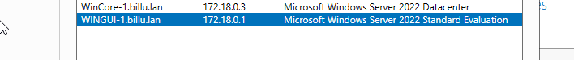

2.2 Puis, allez dans `Manage` > `Add Roles and Features`

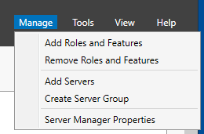

2.3 Choisir les rôles à installer

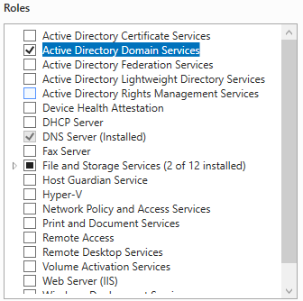

2.4 Vérifier l’installation de la fonctionnalité `Group Policy Management`
   
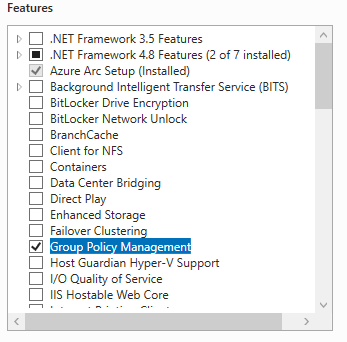
   
2.5 Redémarrez puis commencez la configuration post installation. 
   
   
2.6 Donnez un nom à votre nouveau domaine Active Directory.

   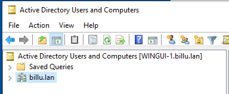
   
2.7 Choisissez le niveau fonctionnel le plus élevé pour votre domaine et votre forêt

   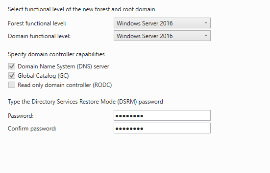
   
2.8 Laissez les chemins par défaut pour les dossiers `NTDS` & `SYSVOL`

   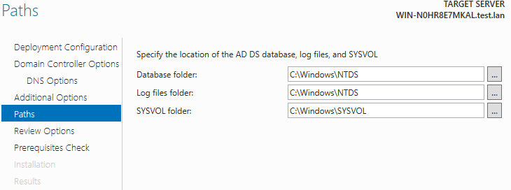

   Continuez l'installation jusqu'à l'écran de vérifications finales puis finalisez l'installation
   
   
   
## 3. Ajout d'un serveur Windows Core à un serveur Windows graphique

### Étape 1 : Connexion au serveur Windows Core
1. Connectez-vous au serveur Windows Core avec un compte administrateur local.
2. Tapez la commande `SConfig` dans l'invite de commande et appuyez sur Entrée.

    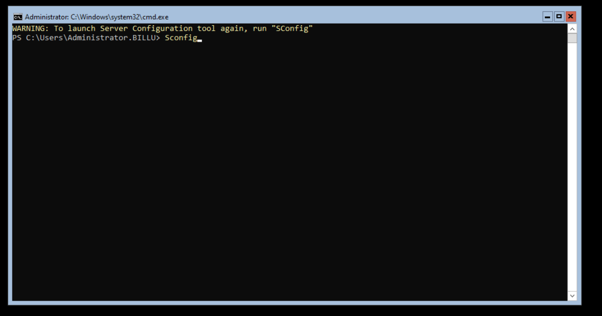
    
### Étape 2 : Modifier le nom de l'ordinateur

1. Sur l'écran de configuration du serveur (*Server Configuration*), sélectionnez l'option **2** en tapant `2` pour modifier le nom de l'ordinateur.

2. Saisissez le nouveau nom (*WINCORE-1*) pour le serveur Core et appuyez sur Entrée. 

3. Redémarrez le serveur lorsqu'on vous le demande.

    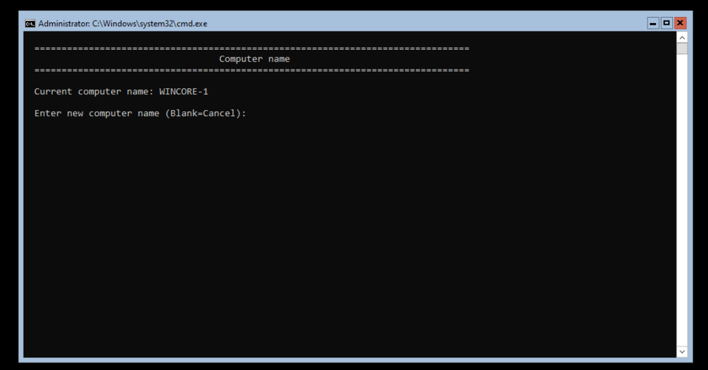

### Étape 3 : Rejoindre le domaine Active Directory

1. Après le redémarrage, reconnectez-vous au serveur et relancez `SConfig`.
2. Sélectionnez l'option **1** (*Domain/Workgroup*) en tapant `1`.
3. Tapez `D` pour joindre un domaine.
4. Indiquez le nom du domaine et d'un utilisateur autorisé dans le format `billu.lan`.
5. Saisissez le mot de passe de l'utilisateur lorsque vous y êtes invité.

    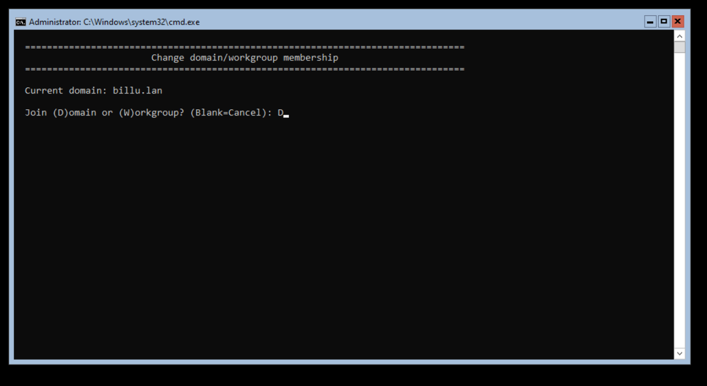

### Étape 4 : Finaliser l'intégration
1. Si on vous propose de changer le nom de l'ordinateur à nouveau, sélectionnez **Non** (puisque cela a déjà été fait).
2. Redémarrez le serveur pour terminer le processus.

### Vérification
Après le redémarrage :
- Connectez-vous au serveur avec les informations d'identification du domaine.
- Tapez `SConfig` pour confirmer que le serveur est bien joint au domaine Active Directory.

    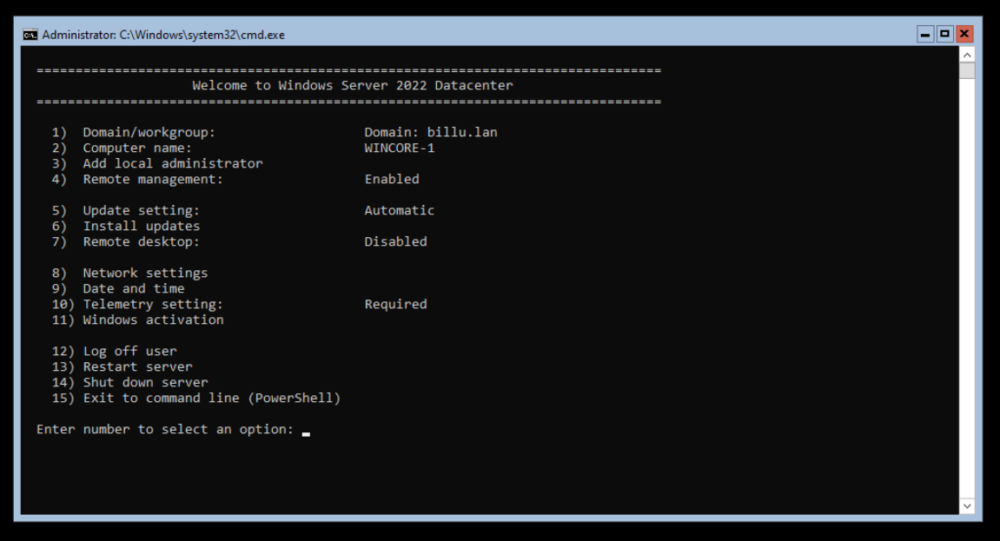

## Contrôler Windows Server Core depuis Windows Server 2022

- Une fois le serveur Core intégré au domaine, vous pouvez le gérer facilement depuis un serveur Windows Server 2022 avec interface graphique. Il suffit d'utiliser le *Server Manager* pour ajouter le serveur Windows Core à la liste des serveurs. Cliquez Manage > Add Servers

    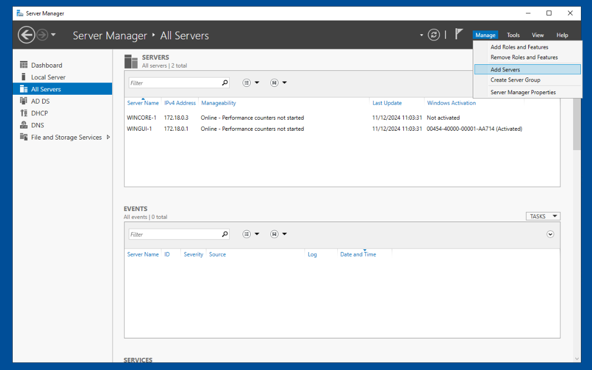 

- Cherchez votre serveur sur l'Active Directory

    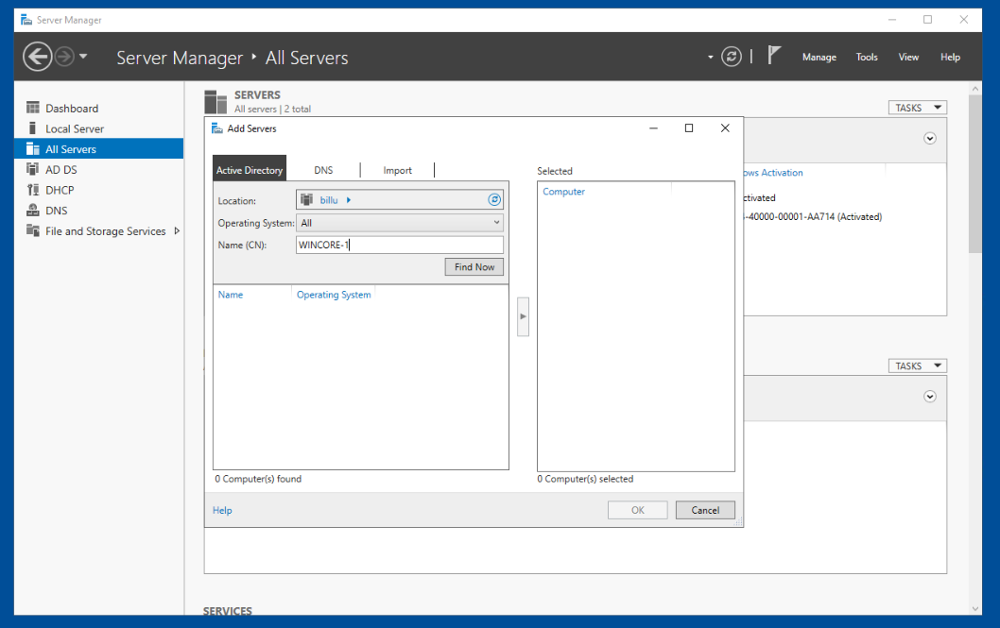
    
- Votre serveur doit apparaître sur le serveur manager

    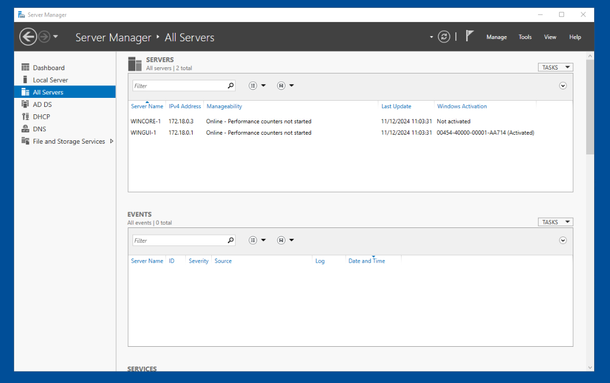

## 4. Créer une Unité Organisationnelle et des groupes de sécurité sur Active Directory

### Étape 1 : Accéder à la console Active Directory Users and Computers
1. Connectez-vous à un serveur Windows avec l'interface graphique et les outils d'administration Active Directory installés.
2. Ouvrez l'outil **Active Directory Users and Computers**.

    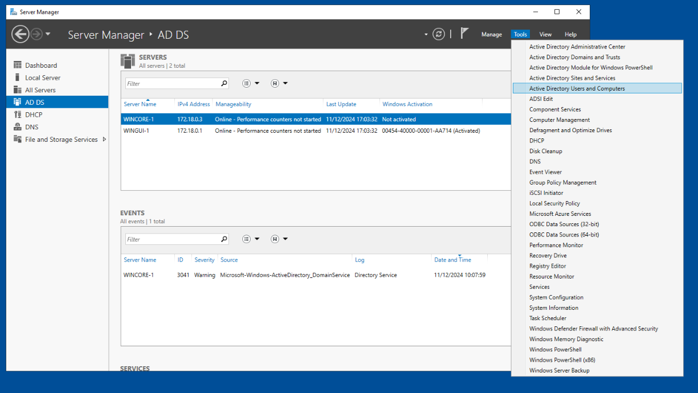

### Étape 2 : Créer une nouvelle Unité Organisationnelle
1. Dans la console AD.DC, naviguez jusqu'au domaine billu.lan (ou domaine souhaité).
2. Faites un clic droit sur le domaine et sélectionnez **New > Organizational Unit**.

    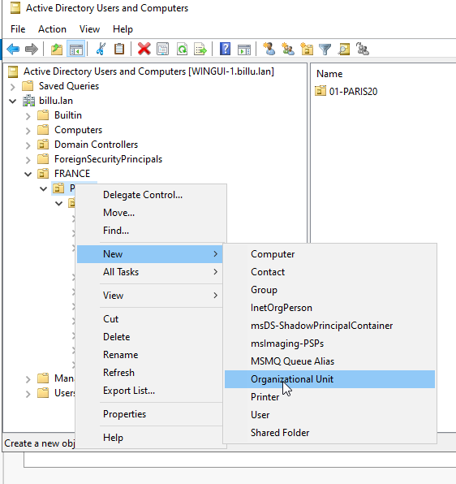

3. Donnez un nom à votre Unité Organisationnelle et cliquez sur **OK**.

    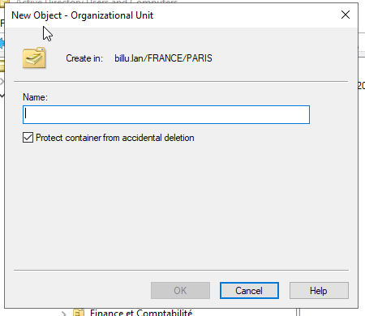

4. La nouvelle Unité Organisationnelle apparaît dans la structure Active Directory.

    

### Étape 3 : Créer un groupe de sécurité
1. Naviguez jusqu'à l'Unité Organisationnelle que vous venez de créer.
2. Faites un clic droit sur l'Unité Organisationnelle et sélectionnez **New > Group**.

3. Donnez un nom à votre groupe.
4. Configurez les paramètres du groupe :
   - **Group Scope** : Choisissez **Global**.
   - **Group Type** : Sélectionnez **Security**.
5. Cliquez sur **OK** pour créer le groupe.

    

### Étape 4 : Ajouter des membres au groupe
1. Faites un clic droit sur le groupe nouvellement créé et sélectionnez **Properties**.
2. Allez dans l’onglet **Members** et cliquez sur **Add**.

    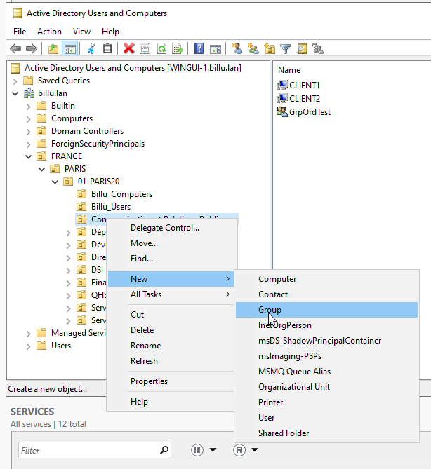

3. Saisissez les noms des utilisateurs ou groupes que vous souhaitez ajouter, puis cliquez sur **Check Names** pour valider.
4. Une fois les membres ajoutés, cliquez sur **OK** pour sauvegarder.

### Vérification
- Retournez à l’onglet **Members** dans les propriétés du groupe pour confirmer que les membres ont été correctement ajoutés.
- Naviguez dans l’Unité Organisationnelle pour vérifier que le groupe et ses membres sont présents.

    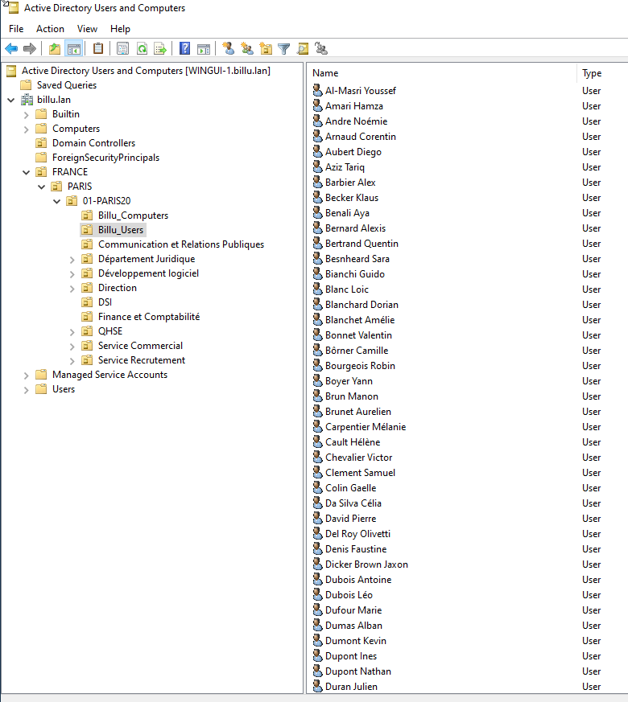

   

   
  

    

