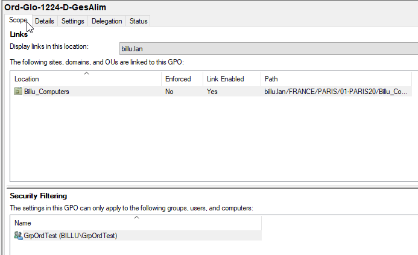

# Documentation Administrateur 
 
## 1 Prérequis Active Directory 

- Avoir un serveur Windows 2022 en graphique, sur lequel les rôles suivant sont installés:
  - Active Directory Domaine Services 
  - DNS 
  - DHCP
Le serveur à sa création a été promut comme contrôleur de domaine

### Prérequis pour Windows serveur 2022

Environnent de test sur Proxmox en VM

* Memory      4 GB
    
* Processors  2 
    
* Reseau      vmbr525

* IP de réseau     : 172.18.0.0/16 
  
* IP de passerelle : 172.18.255.254 
  
* IP DNS           : 172.15.255.254 

## 2 Configuration des GPO ( Group Policy Object )
 - La configuration des GPOs est effectué depuis l'outil "Group Policy Management", accessible depuis l'onglet Tools de Server Manager
 
### Configuration des GPOs de sécurité

#### GPO: Blocage de l'accès au panneau de configuration
- Type de GPO: Utilisateur
- Nommage de la GPO: Usr-Glo-1224-D-PanConf
- Chemin d'accès du paramétrage de la GPO:
   - Users Configuration → Administrative Templates Policy definitions → Control Panel → Prohibit access to control Panel and PC settings
- Paramètres de la GPO :
   - Cocher la case enabled
   - Ajouter les commentaires 
   - Valider

  
     
- GPO status: enabled
    
  

- Groupes de filtrage:
   - Authenticated Users
   - GrpGlobal
- OU de lien de la GPO: 01-PARIS20
  
  

#### GPO: Demande du mot de passe de l'utilisateur pour sortir de l'écran de veille
- Type de GPO: Utilisateur
- Nommage de la GPO: Usr-Glo-1224-A-EcrVeil
- Chemin d'accès du paramétrage de la GPO: 
  - Users Configuration → Administrative Templates Policy definitions → Control Panel → Personalization
- Pamètres de la GPO:
  - Enabled screen saver → enabled
  - Password protect the screen saver -> enabled
  - Load a specific theme → enabled
  
  
  
- GPO status: Computer configuration settings disabled
  
    
  
- Groupes de filtrage:
   - Authenticated Users
   - GrpGlobal
- OU de lien de la GPO: 01-PARIS20
  
     
  
#### GPO: Limitation des tentatives d'élévation de privilèges
- Type de GPO: Computer
- Nommage de la GPO: Ord-Glo-1224-D-LimPriv
- Chemin d'accès du paramétrage de la GPO:
  - Computer Configuration → Policies → Windows Settings → Security Settings → Local Policy → Security Options
- Paramètres de la GPO: 
  - User Account Control: Behavior of the elevation prompt for administrators in Admin Approval Mode → Prompt for credentials
  - User Account Control: Behavior of the elevation prompt for standard users → Prompt for credentials
  
  
  
- GPO status: User configuration settings disabled
  
  
  
- Groupes de filtrage:
   - GrpOrdTest
   
- OU de lien de la GPO: Billu_Computers

  

#### GPO: Blocage de l'accès à Powershell
- Type de GPO: Utilisateur
- Nommage de la GPO: Usr-Glo-1224-D-SecuPS
- Chemin d'accès du paramétrage de la GPO:
  - Users Configuration → Policies → Windows Settings → Security Settings → Software Restriction Policies → Additional Rules
- Paramètres de la GPO:
  - Pour chaque versions de Powershell il est necessaire de créer une nouvelle règle en précisant le chemin d'accès au logiciel. ce dernier se situ dans: C:\Windows\SysWOW64\WindowsPowerShell\...
  
    
  
- GPO status: Computer configuration settings disabled
  
  
  
- Groupes de filtrage:
   - Authenticated Users
   - GrpGlobal
- OU de lien de la GPO: 01-PARIS20

  

### Configuration des GPOs standardisation des comptes utilisateurs 

#### GPO: Uniformisation du fond d'écrans des comptes utilisateurs
- Type de GPO: Utilisateur
- Nommage de la GPO: Usr-Glo-1224-A-FondEcran
- Chemin d'accès du paramétrage de la GPO: 
  - Users Configuration → Policies → Administrative Templates Policy definitions → Desktop → Desktop → Desktop Wallpaper
- Pamètres de la GPO:
  - Cocher enabled
  - Préciser le chemin complet du fichier utilisé comme fond d'écran. Ce fichier se doit d'être placé dans un dossier partagé avec un paramétrage de sécurité qui permet la lecture à tous les utilisateurs
  
   
  
- GPO status: Enabled
  
  
  
- Groupes de filtrage:
   - Authenticated Users
   - GrpGlobal
- OU de lien de la GPO: 01-PARIS20
  
  
  
#### GPO: Mappage des lecteurs ( ex: Département CRP )
- Type de GPO: Utilisateur
- Nommage de la GPO:  Usr-CRP-1224-A-MapDrivDep
- Chemin d'accès du paramétrage de la GPO: 
  - Users Configuration → Preferences → Windows Settings → Drive Maps → Drive Map (Drive :K)
- Pamètres de la GPO:
  
- Type de GPO: Ordinateur
- Nommage de la GPO: Ord-Glo-1224-A-DepLogFir
- Chemin d'accès du paramétrage de la GPO: 
  - Computer Configuration → Policies → Software Settings → Software installation 
- Pamètres de la GPO:
  
  
  
- GPO status: Enabled
  
  
  
- Groupes de filtrage:
   - GrpOrdTest 
- OU de lien de la GPO: Billu_Computers

  
  
#### GPO: Gestion de l'alimentation
- Type de GPO: Ordinateur
- Nommage de la GPO: Ord-Glo-1224-D-GesAlim
- Chemin d'accès du paramétrage de la GPO: 
  - Computer Configuration → Policies → Administrative Templates → System → Power Management
- Pamètres de la GPO:
   
  
  
- GPO status: Enabled
  
  
  
- Groupes de filtrage:
   - GrpOrdTest
- OU de lien de la GPO: Billu_Computers
  
  
  
#### GPO: Gestion de la mise en veille des postes utilisateurs en cas d'inactivité
- Type de GPO: Utilisateur
- Nommage de la GPO: Usr-Glo-1224-A-Misveil
- Chemin d'accès du paramétrage de la GPO: 
  - Users Configuration → Administrative Templates Policy definitions → Control Panel → Personalization → Screen saver timeout
- Pamètres de la GPO:
  - Number of seconds to wait to enable the screen saver

  

- GPO status: Computer configuration settings disabled

  

- Groupes de filtrage:
   - Authenticated Users
   - GrpGlobal
- OU de lien de la GPO: 01-PARIS20

  

## 3 Installation et configuration d'un serveur de gestion de parc: 

Prérequis techniques
- Avoir AD DS
- Avoir une VM Debian
  
Étapes d'installation et de conf. : instruction étape par étape

Install/conf 1 : GPO Sécurité ( 1 exmeple) blocage panneau conf

Install Conf 2 : Gpo Standard ( 1 exemple) fond d'écran

Install Conf 3 : GLPI 
lien vers dossier ressources -> doc dominique

FAQ : solutions aux problèmes connus et communs liés à l’installation et à la configuration
