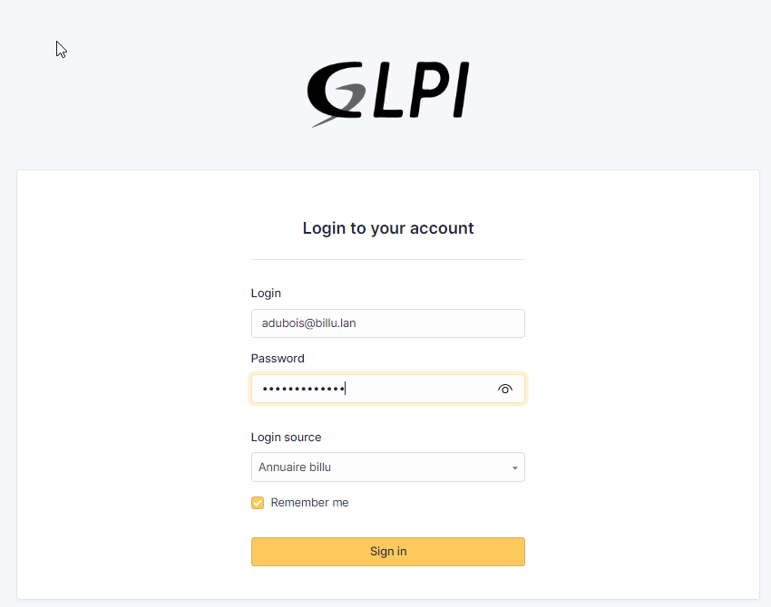

## Comment accéder à sa session personnelle sur son poste de travail ? 

Pour vous connecter à votre session personnelle vous devrez remplir les informations de connexion suivantes : 
- Identifiant de connexion en miniscule → première lettre de votre prénom + point + votre nom de famille 
- Mot de passe par défaut pour votre première connexion `Azerty1*`

Exemple pour Antoine Dubois:

Identifiant de connexion → `a.dubois`

Mot de passe par défaut → `Azerty1*`

 
Lors de votre première connexion à votre session personnelle vous aurez l'obligation de modifier votre mot de passe en respectant les règles de sécurité en vigueur.

Un texte d'information s'affichera pour vous confirmer la bonne modification du mot de passe. 

## Comment signaler un problème sur mon ordinateur ? 

Sur votre bureau de votre session vous trouverez un raccourcci qui vous redirigera vers le système de ticketing. 

Pour vous connecter, utiliser votre adresse email professionnelle en @billu.lan comme identifiant et votre mot de passe de session. 

**ATTENTION** Il faut sélectionner le `login source` *Annuaire Billu*

Sur votre page d'accueil, vous avez un tableau de bord des différents incidents en cours et passés.

Vous pouvez créer un ticket via le panneau de gauche pour faire remonter aux services techniques un incident ou un problème lié à votre ordinateur.

## FAQ : 

### Je n'ai pas accès à ma session depuis mon poste de travail

Plusieurs explications sont possibles: 
- Votre poste de travail affiche-t-il le bon domaine, en dessous des champs d'identifiants ? Si oui, alors vérifiez vos identifiants de connexion et le mot de passe par défaut lors de votre prochaine tentative.
Si non, contacter votre Service informatique
- Vos accès n'ont pas encore été crée
- Vous avez fait une erreur dans vos identifiants de connexion
- Vous avez fait plus de 3 tentatives de connexion
- Le poste de travail à des restrictions vous empêchant de vous connecter

Si le problème persiste, contacter le service informatique.

### Je n'arrive pas à changer mon mot de passe 

Lors d'un changement de mot de passe , lors de la première connexion ou non, vous devez respecter les règles de sécurité vis-à-vis des mots de passe, mises en place par l'entreprise. Par exemple, Billu demande un minimum de 8 caractères pour un mot de passe, et il ne peut être changé que tous les 24 heures.
Si le problème persiste, contacter le service informatique.

### J'ai les bons identifiants mais on me refuse la connexion
Des mesures de sécurité peuventvous empêcher de vous connecter même si vous possédez les bons identifiants. En effet, chaque utilisateur dispose d'une plage horaire de connexion de 7h à 20h, si vous essayez de vous connecter en dehors, l'accès vous sera refusé. 
Votre session peut également être vérouillée suite à de trop nombreuses tentatives de connexion ratées. 
Il est également possible que le problème vienne du poste de travail en lui-même (cf point 5 question 1).
Si le problème persiste, contacter le service informatique.

### Je n'arrive pas à accèder à la plateforme de ticketing 

Soyez vigilants car l'identifiant de la palteforme de ticketing (GLPI) n'est pas le même que celui de votre session. Vous devez utiliser votre adresse mail professionnelle puis votre mot de passe de session.
De plus, dans le champs `login source` sélectionnez bien *Annuaire Billu* afin d'accéder à la bonne plateforme. 

Si le raccourci sur le bureau n'est pas présent ou supprimé par erreur, vous pouvez vous rendre temporairement sur http://172.18.0.4/  
 
Si le problème persiste, contacter le service informatique.

### J'ai un problème avec un logiciel que faire ? 

Vous pouvez dès à présent créer un ticket expliquant votre problème pour faire parvenir l'information au service compétent. Pour vous rendre sur la plateforme dédiée au ticketing double-cliquer sur le raccourci présent sur le bureau. 

