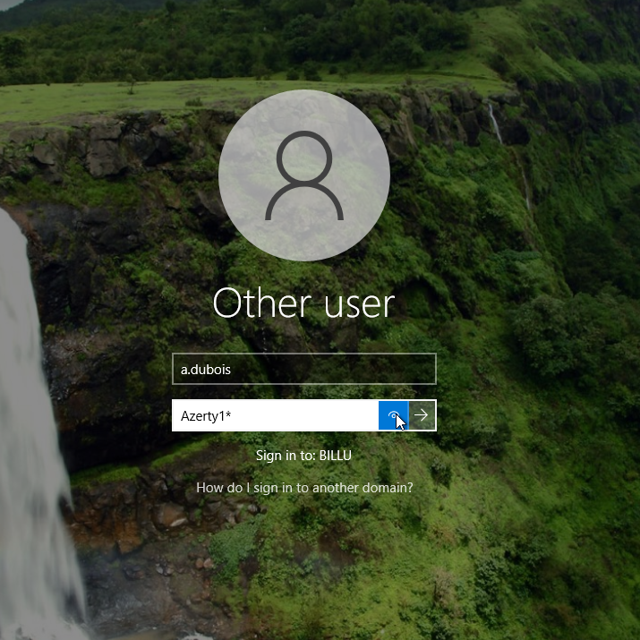

## Comment accéder à sa session personnelle sur son poste de travail ? 

Pour vous connecter à votre session personnelle vous devrez remplir les informations de connexion suivantes : 
- Identifiant de connexion en miniscule → première lettre de votre prénom + point + votre nom de famille 
- Mot de passe par défaut pour votre première connexion `Azerty1*`

Exemple pour Jean Dupont:

Identifiant de connexion → `j.dupont`

Mot de passe par défaut → `Azerty1*`

 
Lors de votre première connexion à votre session personnelle vous aurez l'obligation de modifier votre mot de passe en respectant les règles de sécurité en vigueur.

Un texte d'information s'affichera pour vous confirmer la bonne modification du mot de passe. 

## Comment signaler un problème sur mon ordinateur ? 

Sur votre bureau de votre session vous trouverez un raccourcci qui vous redirigera vers le système de ticketing. 

Pour vous connecter, utiliser votre adresse email professionnelle en @billu.lan comme identifiant et votre mot de passe de session. 
**ATTENTION** Il faut sélectionner le `login source` *Annuaire Billu*

Sur votre page d'accueil, vous avez un tableau de bord des différents incidents en cours et passés.

Vous pouvez créer un ticket via le panneau de gauche pour faire remonter aux services techniques un incident ou un problème lié à votre ordinateur.

FAQ : 

FAQ :
