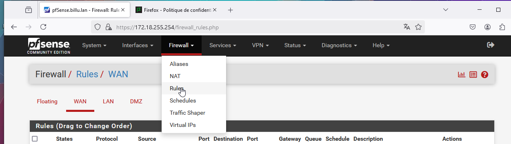

# Documentation Administrateur 

## 1 Gestion d'un firewall pfSense

1. Mise en place de réglés de pare-feu WAN, LAN, DMZ

    1. Apres l'installation du serveur pfsense
    2. Entrer l'option 3 pour configurer l'interfaces IP

    

    3. Sur une session client ouvrer une page d'un navigateur internet et dans la barre de recherche taper l'adresse IP LAN

    

    4. 

 2. Gestion de la télémétrie par GPO 

