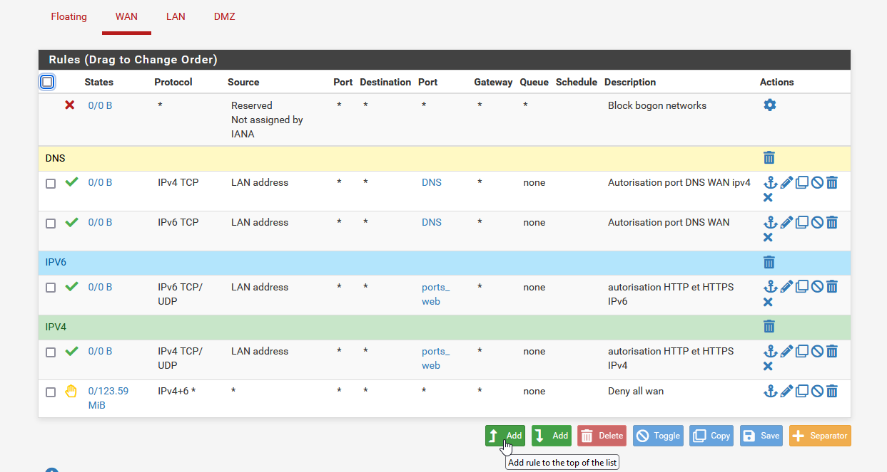

# Documentation Administrateur 

## 1 Gestion d'un firewall pfSense

1. Mise en place de réglés de pare-feu WAN, LAN, DMZ

    1.1  Apres l'installation du serveur pfsense \
    2.1 Entrer l'option 2 pour configurer l'interfaces IP

    

    3.1 Sur une session client ouvrer une page d'un navigateur internet et dans la barre de recherche taper l'adresse IP LAN

    

    4.1 Vous arriver sur la page de login 

    

    5.1 Une fois le login et le MDP valider, vous arriver sur la pages d'accueil

    

    6.1 Vous pouvez aller dans l'onglet Firewall et Rules

    

    7.1 vous pouvez ajoutez une Rules

    

    8.1 Edit un Rule

    
    

    9.1 Une fois le Rule sauvegarder il apparait dans l'onglet Firewall/rules
    
    
    

    10.1 Vous pouvez supprimer un rule avec Delete, desactiver au activer rule avec Toggle, Copier un rule avec Copy, Sauvegarder un rule avec Save, Ajouter un Separateur avec un couleur differente avec Separator
    
    

 2. Gestion de la télémétrie par GPO 

    1.2 Création de la GPO

    

    2.2 Chemin pour gestion de la GPO

    

    3.2 Paramètre a Enabled

    
    

