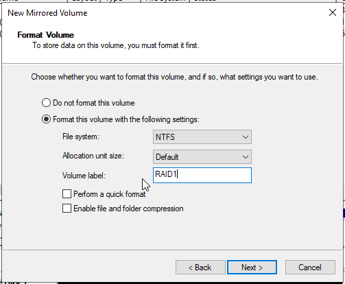
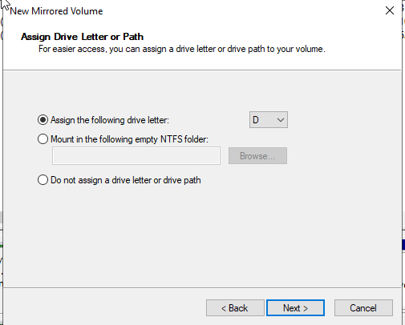
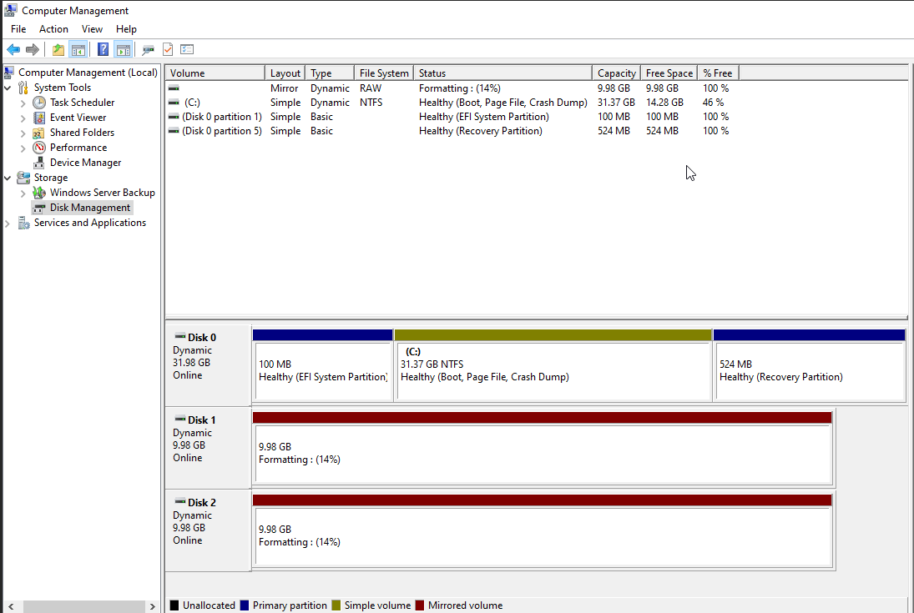
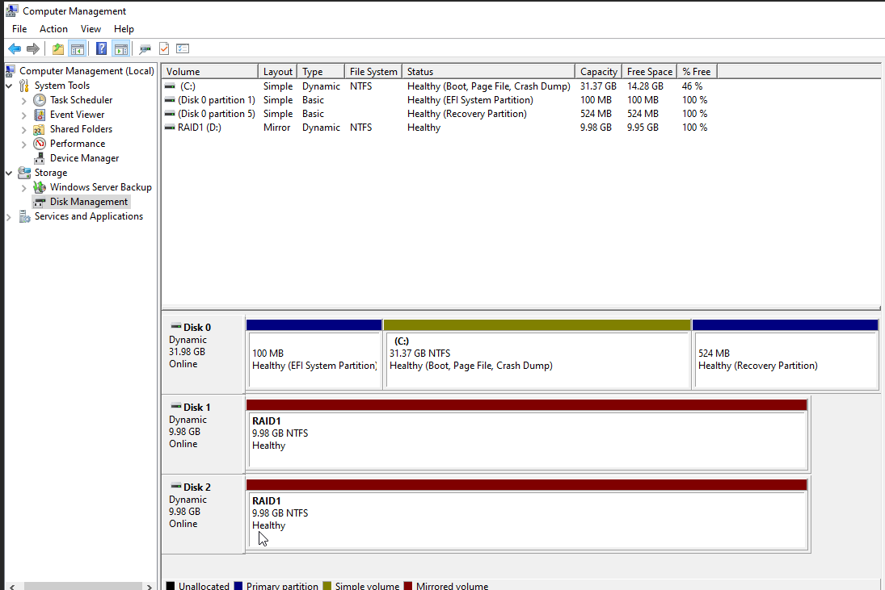
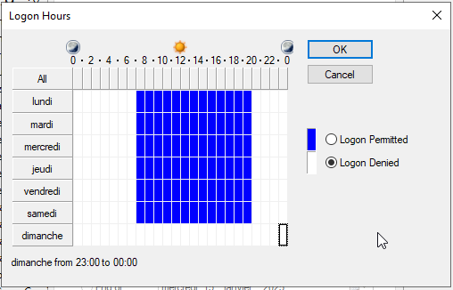
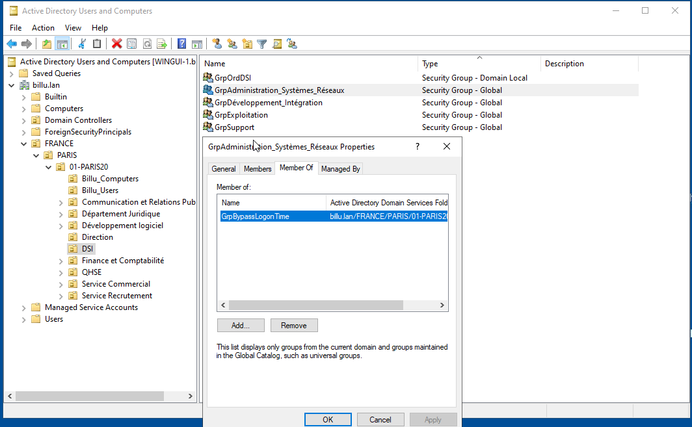

## 1 Mise en place de dossiers réseau pour les utilisateurs

1.1 Stockage des données sur un volume spécifique

1.2 Sécurité de partage des dossiers par groupe AD

1.3  Mappage des lecteurs sur les clients (au choix) : GPO

 - Un **dossier individuel** , avec une lettre de mappage réseau **I**, accessible uniquement par cet utilisateur
 - Un **dossier de service**, avec une lettre de mappage réseau **J**, accessible par tous les utilisateurs d'un même service.
 - Un **dossier de département**, avec une lettre de mappage **K**, accessible par tous les utilisateurs d'un même département.

## 2 STOCKAGE AVANCÉ - Mettre en place du RAID 1 sur un serveur

### 2.1 Mise en place pour Windows serveur 2022 pour le RAID

Environnent de test sur Proxmox en VM

* Memory      4 GB
    
* Processors  2 

* Hard Disk 32 G pour L'OS 

* Hard Disk 10 G pour le RAID

* Hard Disk 10 G pour le deuxieme disque du RAID
    
* Reseau      vmbr525

* IP de réseau     : 172.18.0.5/16 
  
* IP de passerelle : 172.18.255.254 
  
* IP DNS           : 172.15.255.254 

### 2.2 Création du RAID 1 

- Dans le Computer Management clique sur New Mirrored Volume

- Choisir le format à utiliser

- Choisir les volumes à utiliser 

- Choisir le chemin 

- Formatage des volumes 

- Formatage reussi

- Votre RAID est maintement fait, Un seul disque est visible mais l'ecriture des données ce fait sur les deux disques.

## 3 SÉCURITÉ D'ACCÈS - Restriction d'utilisation

3.1 Pour les utilisateurs standard : connexion autorisée de 7h00 à 20h, du lundi au samedi sur les clients (bloquée le reste du temps)

3.2 Pour les administrateurs : bypass

3.3 Gestion des exceptions : prévoir un groupe bypass

# SAUVEGARDE - Mettre en place une sauvegarde de données

1. Faire le bon choix des données à sauvegarder (ex.: dossiers partagés des utilisateurs)
2. Emplacement de la sauvegarde sur un disque différents de celui des données d'origine
3. Mettre en place une planification de sauvegarde (script, AT, GPO, logiciel, etc.)
