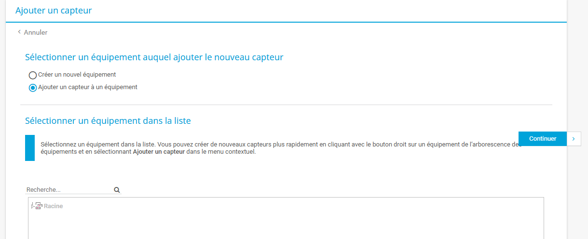

## 1. Journalisation 

### Prérequis 

Contenaire Debian 12

Environnent de test sur Proxmox en VM

* Memory      8 GB
    
* Processors  4
    
* Réseau      vmbr525

* Adresse IP de réseau     : 172.18.0.9/16 
  
* Adresse IP de passerelle : 172.18.255.254 
  
* Adresse IP du DNS        : 172.15.255.254 

1.1 Mise en place de la journalisation 

- Installation Pas à pas de Graylog

        sudo apt-get update
        sudo apt-get install curl lsb-release ca-certificates gnupg2 pwgen

- Installation de MongoBB

        curl -fsSL https://www.mongodb.org/static/pgp/server-6.0.asc | sudo gpg -o /usr/share/keyrings/mongodb-server-6.0.gpg --dearmor  

        echo "deb [ signed-by=/usr/share/keyrings/mongodb-server-6.0.gpg] http://repo.mongodb.org/apt/debian bullseye/mongodb-org/6.0 main" | sudo tee /etc/apt/sources.list.d/mongodb-org-6.0.list

        apt-get update

        wget http://archive.ubuntu.com/ubuntu/pool/main/o/openssl/libssl1.1_1.1.1f-1ubuntu2.23_amd64.deb
        dpkg -i libssl1.1_1.1.1f-1ubuntu2.23_amd64.deb

        apt-get install -y mongodb-org

        systemctl daemon-reload
        systemctl enable mongod.service

        systemctl restart mongod.service
        systemctl --type=service --state=active | grep mongod

- Installation d'OpenSearh

        curl -o- https://artifacts.opensearch.org/publickeys/opensearch.pgp | gpg --dearmor --batch --yes -o /usr/share/keyrings/opensearch-keyring  

        echo "deb [signed-by=/usr/share/keyrings/opensearch-keyring] https://artifacts.opensearch.org/releases/bundle/opensearch/2.x/apt stable main" | sudo tee /etc/apt/sources.list.d/opensearch-2.x.list

        apt-get update

        env OPENSEARCH_INITIAL_ADMIN_PASSWORD=IT-Connect2024! apt-get install opensearch

        nano /etc/opensearch/opensearch.yml

    - Configurez les options suivantes 

            cluster.name: graylog
            node.name: ${HOSTNAME}
            path.data: /var/lib/opensearch
            path.logs: /var/log/opensearch
            discovery.type: single-node
            network.host: 127.0.0.1
            action.auto_create_index: false
            plugins.security.disabled: true

- Configuration de JVM

        sudo nano /etc/opensearch/jvm.options

    - Modifier la memoire

        -Xms1g \
        -Xmx1g

        Par les lignes 

        -Xms4g \
        -Xmx4g

    - Verifier avec la commande 

            cat /proc/sys/vm/max_map_count

    - Activez le demmarrage automatique 

            systemctl daemon-reload
            systemctl enable opensearch
            systemctl restart opensearch

- Installation de graylog 

        wget https://packages.graylog2.org/repo/packages/graylog-6.1-repository_latest.deb
        dpkg -i graylog-6.1-repository_latest.deb
        apt-get update
        apt-get install graylog-server

    - Générer la clé de 96 

            pwgen -N 1 -s 96

- Collez la clé au niveau du paramétre "password_secret"

            nano /etc/graylog/server/server.conf

- faitez les modification suivantes

- Démarrer graylog

            systemctl enable --now graylog-server

- Vous pouvez désormais vous connecter avec votre compte admin sur un moteur de recherche internet 

- Desactivation de la télémetrie 

- Creation d'un profil

- Creation d'un journal 

Vous obtenez comme resultat

Et voici la page de garde de votre journalisation

## 2. Supervision 

### Prerequis 

### Prérequis pour Windows serveur 2022

Environment de test sur Proxmox en VM

* Memory      4 GB
    
* Processors  2
    
* Réseau      vmbr525

* Adresse IP de réseau     : 172.18.0.5/16 
  
* Adresse IP de passerelle : 172.18.255.254 
  
* Adresse IP du DNS        : 172.15.255.254 

2.1 Installation de PRTG

- Télecharger PRTG a l'aide de ce [lien](https://www.paessler.com/fr) 

- Cliquer sur Téléchargement gratuit 

- Exécuter le fichier télécharger 

- Choix de la langue

- Accord de la licence

- Entrer une adresse e-mail et cliquer sur le bouton suivant
- Choisissez le mode d'installation

- Patienter pendant l'installation PRTG

- parametrage de PRTG

- Ajout d'un capteur 

- Vous pouvez crée un equipement et/ou capteur

- Choix de l'equipement a supervisé 

- Parametrage du capteur

- Resultat 

