# Installation IRedMail

## Prérequis techniques

Contenaire Debian 12

Environnent de test sur Proxmox en VM

Memory 4 GB

Processors 4

Réseau vmbr525

Adresse IP de réseau : 172.18.0.10/16

Adresse IP de passerelle : 172.18.255.254

Adresse IP du DNS : 172.18.0.1

## Étapes d'installation et de conf. : instruction étape par étape

### Configuration du FQDN en tant que hostname sur le serveur

Sur une VM Debian, faites la commande `hostname -f` pour voir votre hostname actuel. Avant l'installation vous devez vous assurez que le format de votre résultat est le suivant 

        $ hostname -f
        debian

Sous Debian12 Linux, le nom d'hôte est défini dans deux fichiers : /etc/hostnameet /etc/hosts.\
* /etc/hostname: nom d'hôte court, pas FQDN.

        mx

* /etc/hosts: recherche de table statique pour les noms d'hôtes. Avertissement : Veuillez indiquer le nom d'hôte FQDN comme premier élément.

 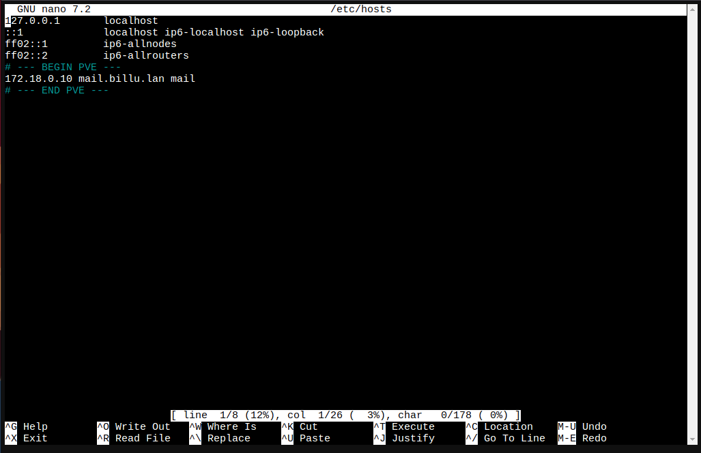

Vérifiez le nom d'hôte FQDN. S'il n'a pas été modifié après la mise à jour des deux fichiers ci-dessus, veuillez redémarrer le serveur pour le faire fonctionner.

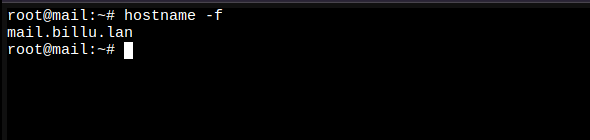

## Activer les dépôts apt officiels Debian/Ubuntu par défaut

* iRedMail a besoin de référentiels apt officiels Debian/Ubuntu, veuillez les activer dans /etc/apt/sources.list.
* Installer les packages requis par le programme d'installation d'iRedMail :

        sudo apt-get install -y gzip dialog

## Téléchargez la dernière version d'iRedMail

* Visitez la page de [téléchargement](https://www.iredmail.org/download.html) pour obtenir la dernière version stable d'iRedMail.

* Téléchargez iRedMail sur votre serveur de messagerie via ftp ou scp ou toute autre méthode que vous pouvez utiliser, connectez-vous au serveur pour installer iRedMail. Nous supposons que vous l'avez téléchargé sur /root/iRedMail-x.y.z.tar.gz(remplacez xyz par le numéro de version réel).

* Décompresser l'archive tar iRedMail :

        cd /root/
        tar zxf iRedMail-x.y.z.tar.gz

## Démarrer l'installateur d'iRedMail

### Il est maintenant prêt à démarrer l'installateur d'iRedMail, il vous posera plusieurs questions simples, tout ce qui est nécessaire pour configurer un serveur de messagerie complet.

        cd /root/iRedMail-x.y.z/
        bash iRedMail.sh

## Captures d'écran de l'installation :

* Bienvenue et merci pour votre utilisation

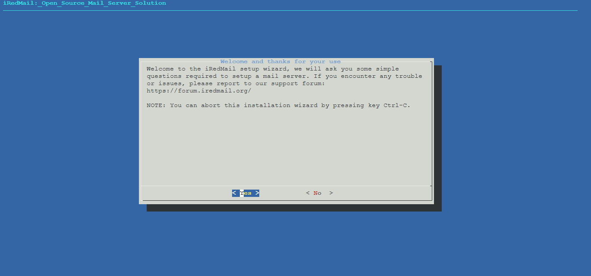

* Spécifiez l'emplacement où stocker toutes les boîtes aux lettres. La valeur par défaut est /var/vmail/.

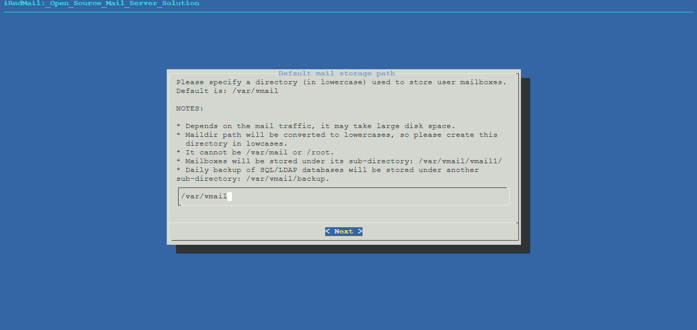

* Choisissez le backend utilisé pour stocker les comptes de messagerie. Vous pouvez gérer les comptes de messagerie avec iRedAdmin, notre panneau d'administration iRedMail basé sur le Web.

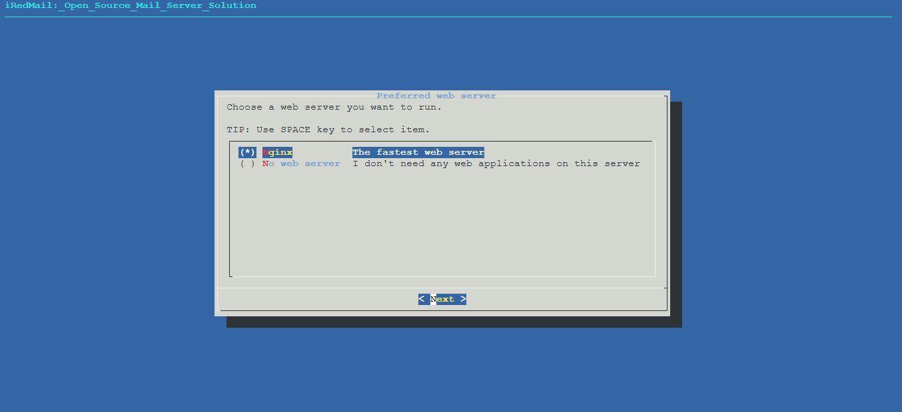

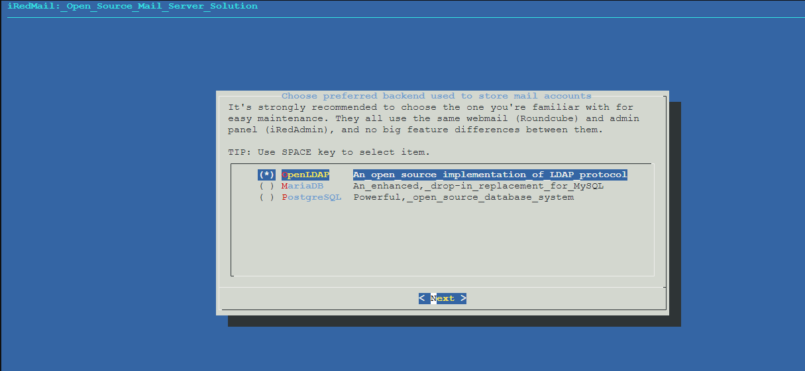

* Si vous choisissez de stocker les comptes de messagerie dans OpenLDAP, le programme d'installation d'iRedMail vous demandera de définir le suffixe LDAP.

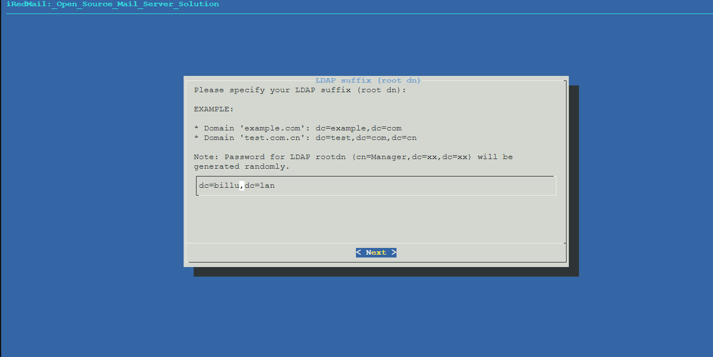

* Ajoutez votre premier nom de domaine de messagerie

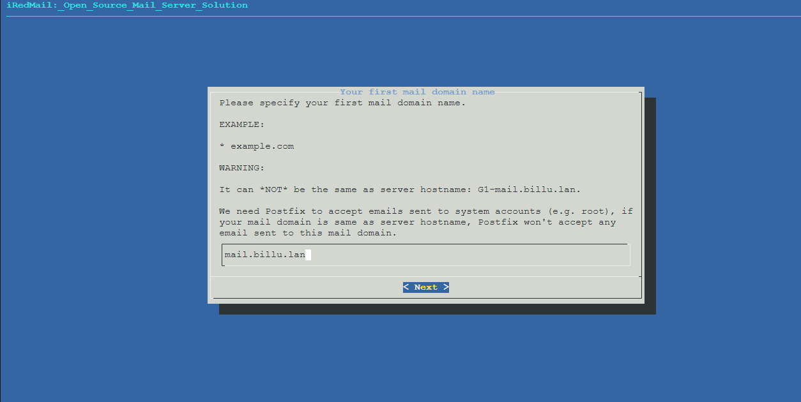

* Définissez le mot de passe du compte administrateur de votre premier domaine de messagerie.

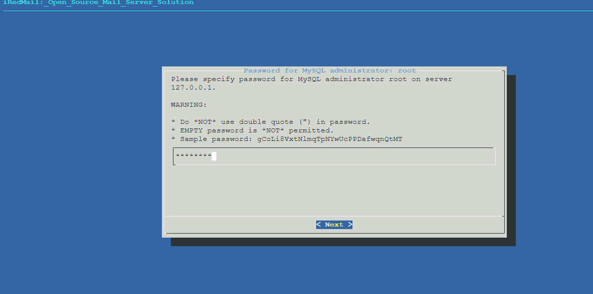

* Choisissez les composants optionnels

 
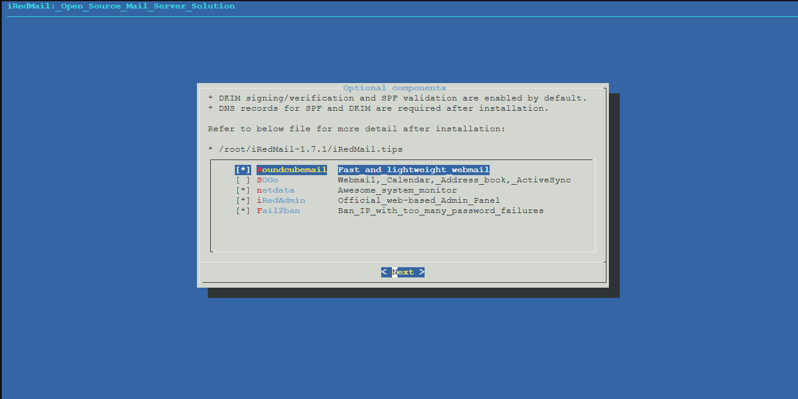

* Après avoir répondu aux questions ci-dessus, l'installateur d'iRedMail vous demandera de vérifier et de confirmer pour démarrer l'installation. Il installera et configurera automatiquement les packages requis. Tapez you Yet appuyez sur Enterpour démarrer.

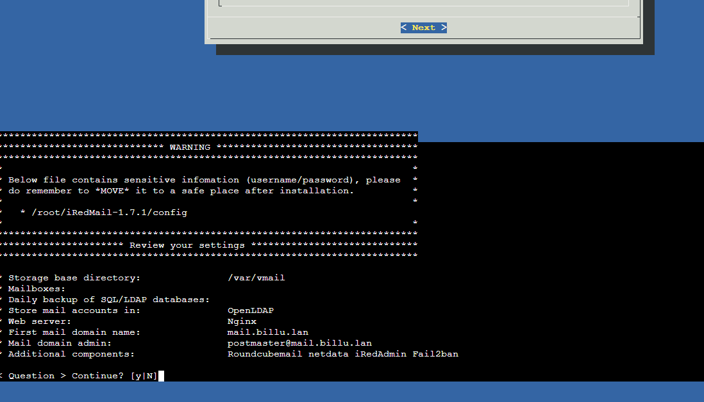

* Comment configurer un A enregistrement

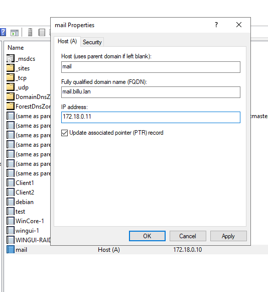

* Enregistrement MX pour le nom de domaine de messagerie

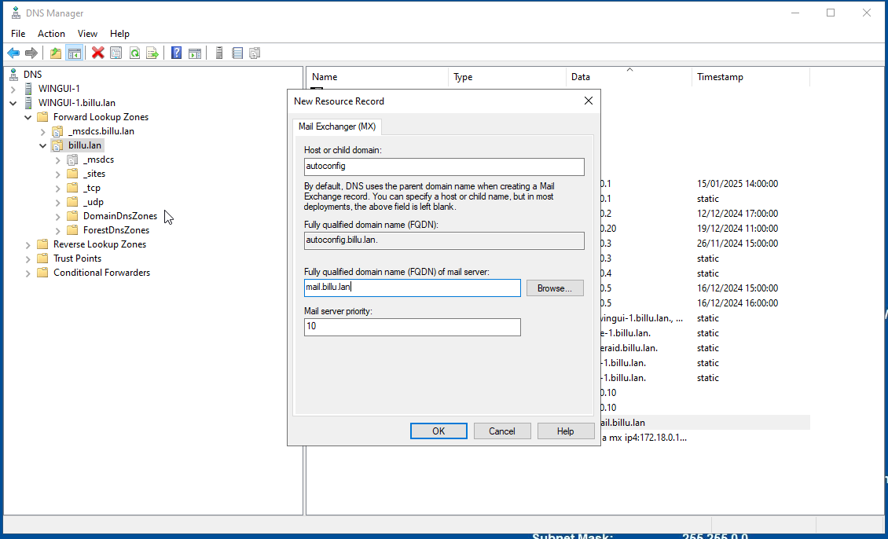

* Creation des news Resource Record

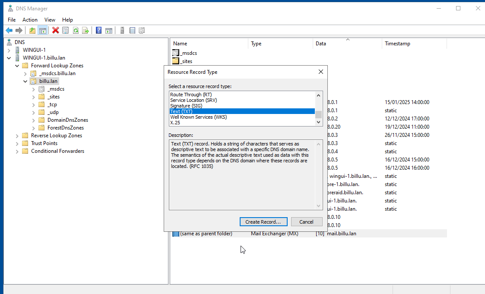
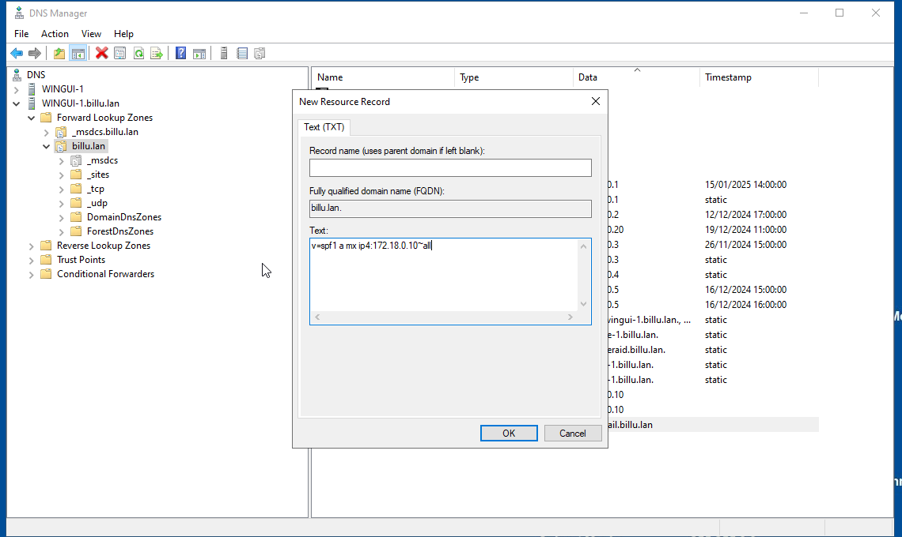
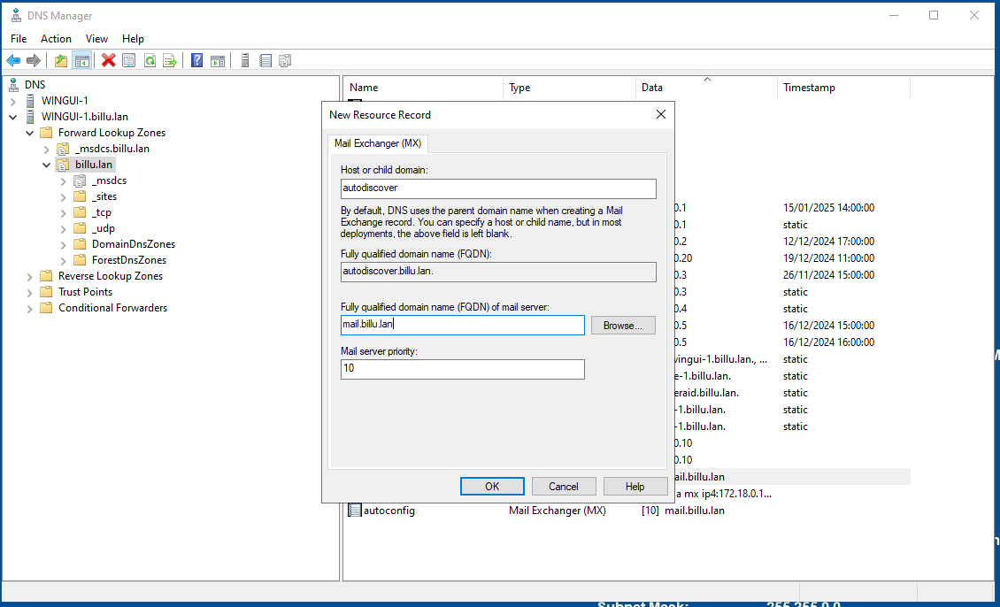
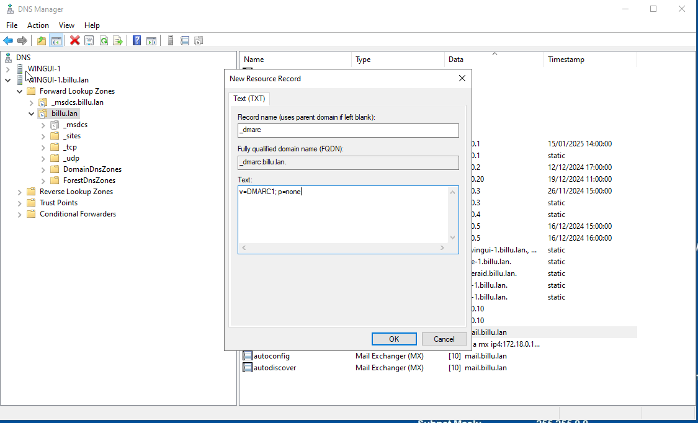

* Acces a IRedMail

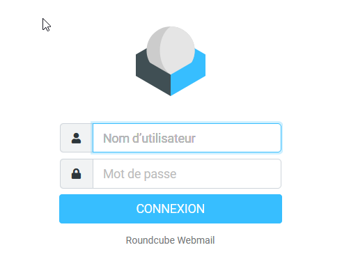

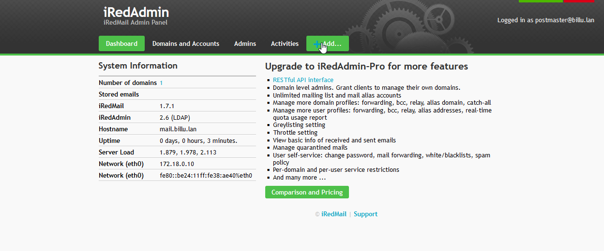

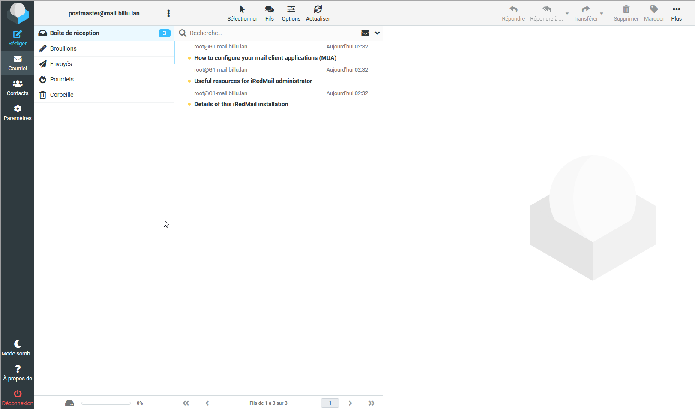

## FAQ : solutions aux problèmes connus et communs liés à l’installation et à la configuration

