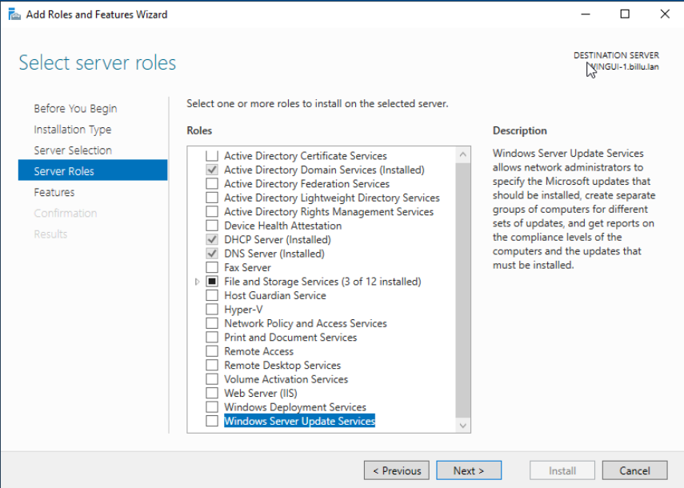
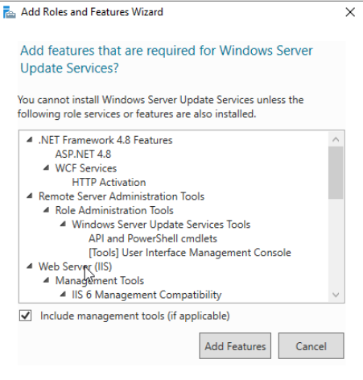
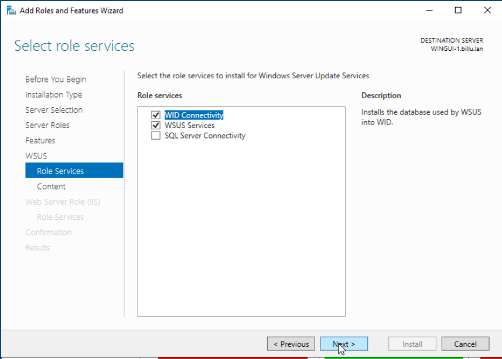
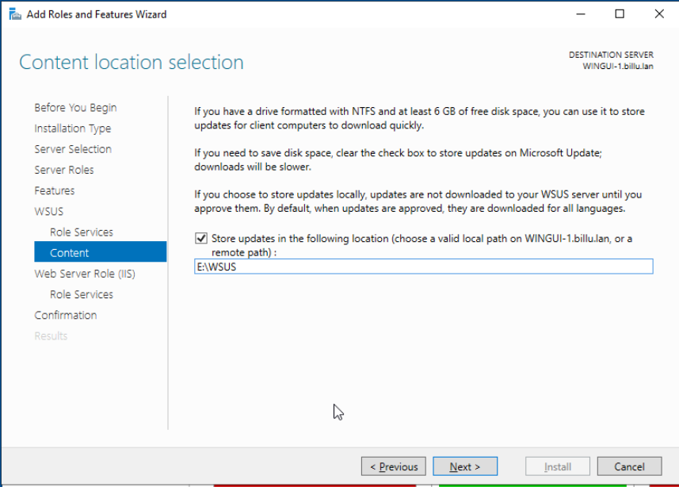
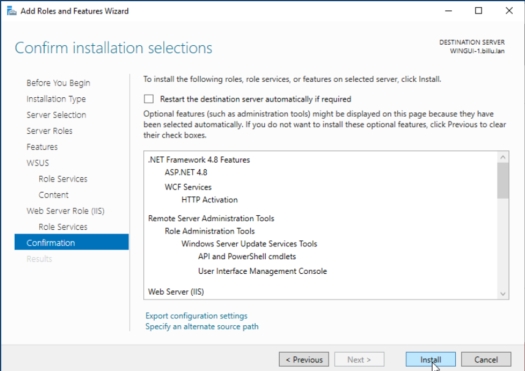

# Infrastructure BillU
 
## 1 Installation du rôle WSUS 
### Prérequis techniques

VM WIndows Server 22

Environnent de test sur Proxmox en VM

Memory 4 GB

Processors 4

Réseau vmbr525

Adresse IP de réseau : 172.18.0.6/16

Adresse IP de passerelle : 172.18.255.254

Adresse IP du DNS : 172.18.0.1

### Installation du rôle WSUS
À partir de Server Manager, installer le rôle Windows Server Update Services. 
  

Cliquer sur le bouton "Add Features", puis sur "Next"
  

Cocher WID Connectivity et WSUS Services
  

  
Entrer le chemin d'accès du disque où nous souhaitons stocker les mises à jour.  
  

  
Cliquer "Next" jusqu'à avoir la proposition"install" 
  

Une fois installer fermer la fenêtre d'installation et cliquer sur le drapeau jaune pour configurer le menu de post-installation du rôle WSUS  
Puis redémarrer le serveur

### Configuration du service WSUS  

## 2 Répartition des rôles FSMO sûr différents DC du domaine

 # Partenariat Ecotechsolution-BillU
 
## 1 Installation d'un tunnel VPN site à site

## 2 Instauration d'une relation d'approbation entre les domaines AD des 2 entreprises
 
