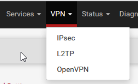

# Infrastructure BillU
 
## 1 Installation du rôle WSUS 
### Prérequis techniques

VM WIndows Server 22

Environnent de test sur Proxmox en VM

Memory 4 GB

Processors 4

Réseau vmbr525

Adresse IP de réseau : 172.18.0.6/16

Adresse IP de passerelle : 172.18.255.254

Adresse IP du DNS : 172.18.0.1

### Installation du rôle WSUS
À partir de Server Manager, installer le rôle Windows Server Update Services. 
  


Cliquer sur le bouton "Add Features", puis sur "Next"
  


Cocher WID Connectivity et WSUS Services
  

  
Entrer le chemin d'accès du disque où nous souhaitons stocker les mises à jour.  
  

  
Cliquer "Next" jusqu'à avoir la proposition"install" 
  


Une fois terminé fermer la fenêtre d'installation et cliquer sur le drapeau jaune pour configurer le menu de post-installation du rôle WSUS  
Puis redémarrer le serveur

### Configuration du service WSUS  


## 2 Répartition des rôles FSMO sûr différents DC du domaine

Le transfert des rôles FSMO sera réalisé avec l'utilitaire NTDSUTIL

### Lancement de l'utilitaire ntdsutil.exe
Ce lancement peut ce faire depuis un terminal cmd ou bien une console Powershell
```
ntdsutil.exe
```
### activer le mode maintenant FSMO
Pour passer en mode "fsmo maintenance" il faut saisir la commande :
```
role
```
### Connexion au serveur auquel on souhaite transférer un rôle
Il faut établir une connexion avec le serveur sur lequel on veut transférer un ou des rôles. Pour cela, dans le mode « fsmo maintenance », tapez la commande :
```
connections
```
Puis il faut préciser le serveur avec lequel on souhaite ce connecter:
```
connect to server WINCORE-1
```
Une fois connecté il faut quitter le mode connexion pour revenir au mode précédent, avec la commande : 'q puis entrer'

### Transférer les rôles FSMO 


 # Partenariat Ecotechsolution-BillU
 
## 1 Installation d'un tunnel VPN site à site
Après plusieurs tentative avec la solution OpenVPN qui se sont avéré infructueuse nous avons choisi d'utiliser une autre solution présente nativement sur notre firewall pfsense et nous avons mis en palce un tunnel VPN site à site avec IPsec

###Paramétrage du tunnel sous PFsense 
- Ce connecter à l'interface graphique de pfsense à l'aide d'un navigateur internet présent sur une machine du résau LAN.
- Dans « VPN -> IPSec
  


- Cliquer sur add P1
- Puis nous complétons les différents champs
  - Description
   


  - internet protocol: IPv4
  - Interface: WAN
  - Remote Gateway qui correspond à l'interface WAN du firewall de l'infra d'EcoTechSolutions
  


  - Dans la partie "phase 1 proposal) on sélectionne Mutual PSK et on génère une Pre-Shared-Key qui serra copier et partagé avec l'entreprise EcoTechSolution nécéssaire pour l'authentification.


Laisser les autres paramètres par défaut et cliquer sur save 

- Cliquer sur Add P2
  - Donner une description,
  
  
  
  - Puis renseigner l'adresse IP du réseau LAN de EcoTechSolutions pour que les réseaux LAN communiquent entre eux.

  

  - Sauvegarder.
- La même configuration doit être réalisée, en adaptant les adresses IP et en intégrant la PSK créée plus haut sur le pare-feu de l'entreprise partenaire, pour pouvoir établir la connexion via le tunnel VPN.

- Créer une nouvelle règle pour activer le VPN : Firewall->Rules-IPsec puis cliquer sur Add
  - la règle de pare feu doit permettre le passage des paquets en provenance du tunnel VPN   

   
 

## 2 Instauration d'une relation d'approbation entre les domaines AD des 2 entreprises
 
