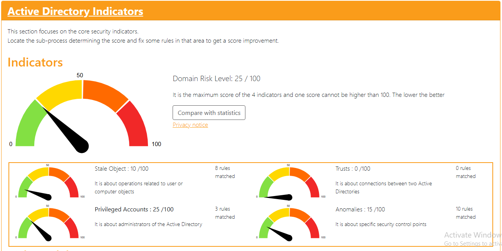

## Prérequis

Contenaire Debian 12

Environnent de test sur Proxmox en VM

  Memory 2 GB

  Processors 2

  Réseau vmbr525

  Adresse IP de réseau : 172.18.0.25/16

  Adresse IP de passerelle : 172.18.255.254

  Adresse IP du DNS : 172.18.0.1

  ## Audits

Afin de lancer les audits, il faut se connecter sur le PC d'adminsitration, ID 559, et lancer une session SSH depuis MobaXterm pour accéder aux différentes machines.  Vous aurez besoin de connaitre les IP et un compte sur lequel effectué la cconnexion SSH.
  

  ### Audit ACTIVE DIRECTORY 
  
  Pour auditer le domaine Active Directory billu, vous pouvez installer  ou . Dans le cas de notre infrastructure, nous utilisons PingCastle, car il suffit de l'installer depuis une machine présente sur l'AD pour qu'il puisse scanner le domaine en entier. Vous recevrez un rapport avec une note sur 100, il faudra tendre vers 0 pour avoir un AD en bonne santé ! 
  
  Avant 
  
  

  Après 
  
  

  
  ### Audit SERVEURS LINUX 

    
   
  
     
   
  
    
  
  ## Panne électrique sur l'infrastructure PRA

  
