## Prérequis

Contenaire Debian 12

Environnent de test sur Proxmox en VM

  Memory 2 GB

  Processors 2

  Réseau vmbr525

  Adresse IP de réseau : 172.18.0.25/16

  Adresse IP de passerelle : 172.18.255.254

  Adresse IP du DNS : 172.18.0.1

 ## VOIP - Mettre en place un serveur de téléphonie sur IP

 ### Installation manuelle de FreePBX avec des commandes

Si vous préférez installer FreePBX manuellement, il dispose de scripts d'installation qui simplifient le processus, mais ils ne fonctionnent qu'avec Debian.

Tout d'abord, accédez à votre VPS en tant que root à l'aide d'un client SSH comme PuTTY ou Terminal. Une fois connecté, suivez ces instructions pour installer FreePBX sur Debian 12 :

  1. Entrez la commande suivante pour accéder au répertoire d'installation :

    cd /tmp

  2. Exécutez ce qui suit pour télécharger le script d’installation de FreePBX 17 :

    wget https://github.com/FreePBX/sng_freepbx_debian_install/raw/master/sng_freepbx_debian_install.sh -O /tmp/sng_freepbx_debian_install.sh

  3. Saisissez les éléments suivants pour démarrer le processus d’installation :

    bash /tmp/sng_freepbx_debian_install.sh

Attendez que le processus d'installation soit terminé. En fonction de votre connexion Internet, cela peut prendre 30 minutes ou plus.

Une fois l’installation terminée, vous devriez voir l’écran de confirmation suivant.

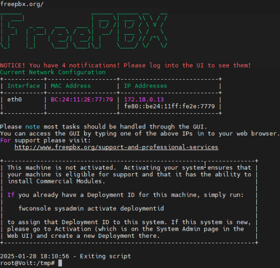

Le script configure automatiquement les autres logiciels requis pour la configuration de FreePBX, notamment le serveur Asterisk , Apache et la base de données MariaDB .

Si vous utilisez un autre système d’exploitation ou ne souhaitez pas les dépendances facultatives, installez ces composants individuellement.

### Terminer l'installation de FreePBX

Suivez ces étapes pour terminer votre installation de FreePBX :

1. Accédez à la page de connexion FreePBX en saisissant votre adresse IP VPS dans un navigateur Web.

2. Remplissez les informations suivantes :

    * Nom d’utilisateur – le nom d’utilisateur de l’administrateur FreePBX.

    * Mot de passe – le mot de passe par défaut de votre compte administrateur.

    * Adresse e-mail de notification – le compte e-mail qui recevra toutes les notifications concernant votre service FreePBX.

    * Identifiant système – le nom de votre serveur FreePBX, de préférence le même que le nom d’hôte de votre VPS.

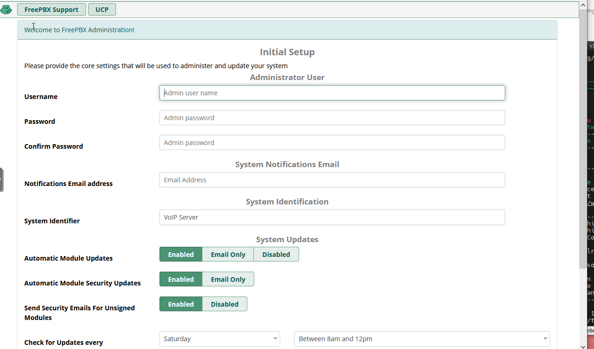

3. Ajustez les paramètres de vos modules et mises à jour. Si vous ne savez pas quoi modifier à ce stade, vous pouvez laisser les choses telles quelles.

4. Cliquez sur Configurer le système .

5. Cliquez sur Not Now

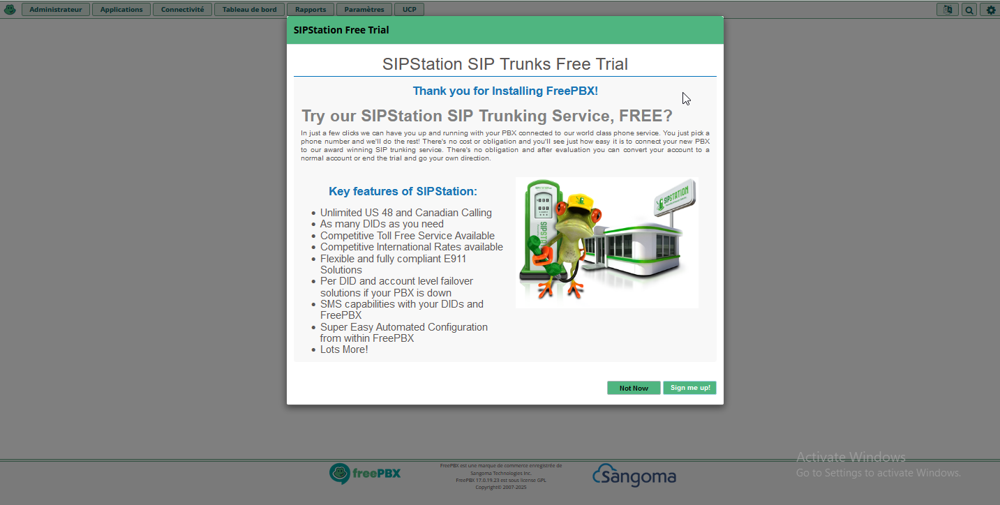

Lorsque vous accédez pour la première fois à l'interface Web principale de FreePBX, vous pouvez voir plusieurs écrans d'activation. N'hésitez pas à les ignorer et à y revenir plus tard.

6. Activation de FreePBX 

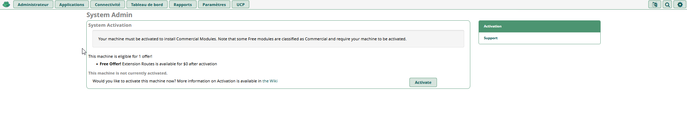

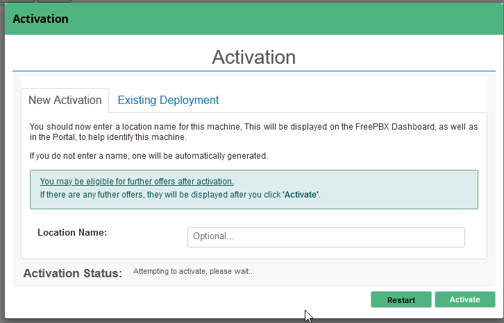
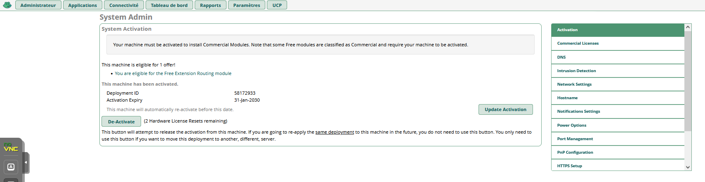

### Configuration de base

Pour commencer à utiliser FreePBX, vous devez configurer les paramètres suivants pour autoriser la communication téléphonique sur votre serveur.

### Configuration des extensions

Dans FreePBX, les extensions sont des points de terminaison permettant de connecter des appels au sein du même réseau et à des services externes. Voici comment procéder :

1. Ouvrez le tableau de bord d’administration FreePBX et connectez-vous en tant qu’administrateur.
2. Allez dans la barre supérieure → Connectivité → Extensions .
3. Cliquez sur Ajouter une extension pour ajouter des informations détaillées sur vos extensions. Puisque nous allons en créer une de base, choisissez Créer rapidement des extensions .
4. Sur la page Étape 1 , ajustez les paramètres suivants :
    * Type d'extension : le type de protocole de communication utilisé par votre extension. Nous choisirons SIP [chan_pjsip] car c'est le plus courant.
    * Numéro de poste : le numéro utilisé par les autres utilisateurs pour composer les postes actuels. Utilisez un numéro à trois à cinq chiffres qui ne commence pas par 1 pour éviter les chevauchements avec les services existants.
    * Nom d'affichage – le propriétaire de l'extension.
    * ID de l'appelant sortant : l'identifiant de l'extension actuelle lors de la numérotation sortante. Nous pouvons le laisser vide.
    * Adresse e-mail – l’adresse e-mail du propriétaire de l’extension.

5. Cliquez sur Suivant .

6. Sur la page Étape 2 , modifiez d’autres paramètres :
    * Activez « Trouvez-moi/Suivez-moi » – la fonctionnalité qui redirige les appels vers un autre téléphone lorsque l'extension ne répond pas.
    * ParkingLot – le module pour mettre en file d'attente et transférer les appels sans réponse vers différentes extensions. Par défaut, vous n'avez que l' option Parking par défaut .
    * Créer un utilisateur Gestionnaire d'utilisateurs – le bouton bascule pour ajouter l'utilisateur à la liste du Gestionnaire d'utilisateurs .
    * Groupes du gestionnaire d’utilisateurs – le groupe auquel appartient votre nouvel utilisateur d’extension.
    * Activer la messagerie vocale – le bouton bascule définissant la messagerie vocale est disponible pour l’extension actuelle.
    * Code PIN de la messagerie vocale : le mot de passe du service de messagerie vocale de votre extension.

7. Cliquez sur Terminer pour enregistrer les paramètres.

Si vous souhaitez ajouter d'autres extensions, répétez simplement les étapes ci-dessus. Pour modifier leurs paramètres, accédez à l' onglet Toutes les extensions et cliquez sur l' icône Modifier sous la colonne Action .

Après avoir modifié les paramètres de FreePBX, n'oubliez pas d'appuyer sur le bouton Appliquer la configuration en haut à droite de l'écran.

8. Ajout de l'annuaire LDAP 

    * Onglet Admin->user management

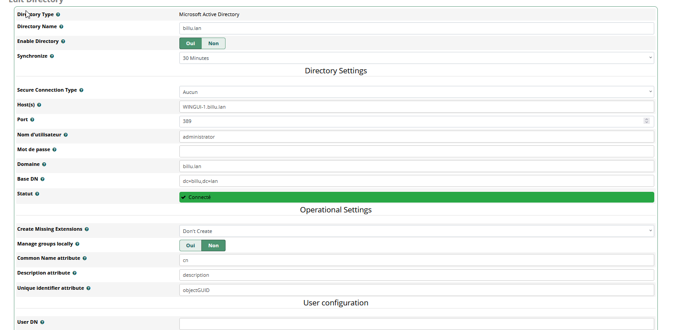

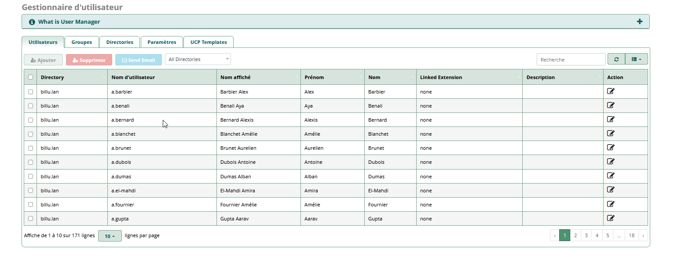

Pour plus de Configuration je vous inviter ce [site](https://www.hostinger.com/tutorials/freepbx-tutorial?utm_campaign=Generic-Tutorials-DSA%7CNT:Se%7CLO:FR-EN&utm_medium=ppc&gad_source=1&gclid=CjwKCAiA-ty8BhA_EiwAkyoa3zxtglyM6rikN4dATKFD6nslgho7Rtfgn4kNtvpUpHA0ascxcU_QIhoC3bQQAvD_BwE)

 ### Mise en place d'une GPO pour 3CX 

 Préreuqis : avoir télécharger le fichier d'installation 3CXPhone .msi svur le lien suivant 
 
La GPO pour déployer 3CX 

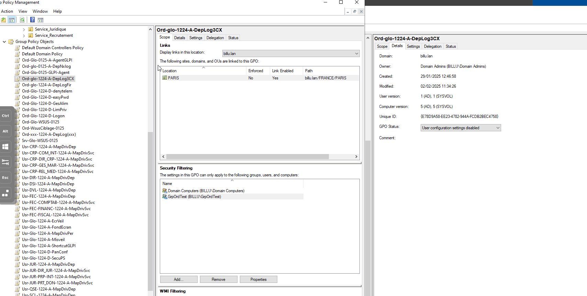

Pour la configuration rendez vous dans `Computer Configuration > Policies > Software Settings > Software installation` puis clic droit `New > Package...`

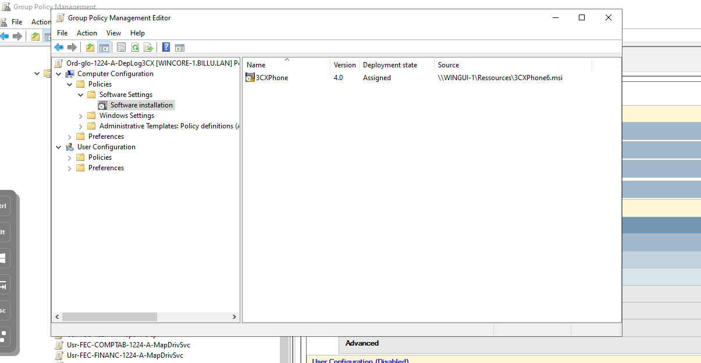

Sélectionner le fichier d'installation .msi , choissisez l'option `Assigned` et validez. 

Assurez vous que la source du programme est bien un chemin UNC et qu'il est accesible sur le réseau.

Il ne reste plus qu'à lier la GPO aux différentes cibles.

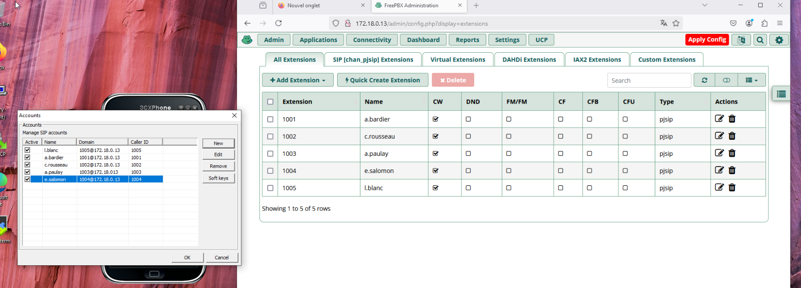
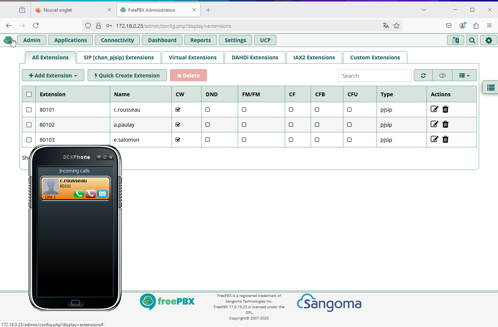

## Installation de Windows Server Backup

Installation de la fonctionnalité WSB depuis le server manager, Manage, add roles and features.
Pour assurer la sauvegarde de notre AD on a choisi d'installer un nouveau serveur core équipé de disk en RAID1 par soucis de fiabilité.

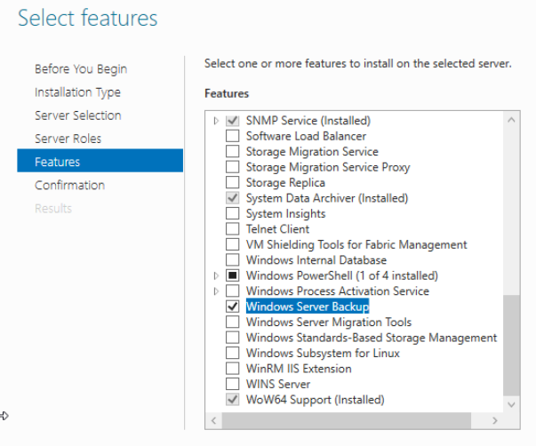

Une fois installé, nous devons configurer WSB pour réaliser la sauvegarde de l'AD. Depuis le server manager, dans all server, faire un clique droit sur le serveur core destiné à héberger la sauvegarde et choisir Computer Management.
  

  
Double cliquer sur Local Backup et choisir Backup Schedule pour des sauvegardes régulières ou backup once pour une sauvegarde ponctuel de l'AD.
Puis configurer les paramètres de sauvegarde dans la fenêtre d'aide
  

  
Next
  

  
Nous choisissons une sauvegarde complète de notre AD
  

Paramètrer le moment de la réalisation de la sauvegarde.
  

  
On choisi d'effectuer la sauvegarde sur un disque dédié, dans le cas présent on choisi le disk monté en RAID sur le serveur core.
  
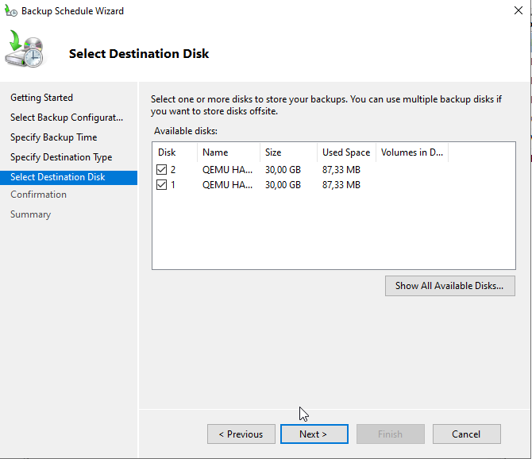
  
On peut consulter les différentes sauvegardes 
  
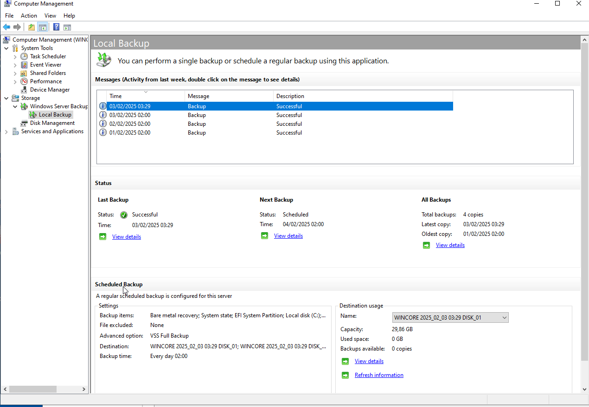
  
## FAQ:

